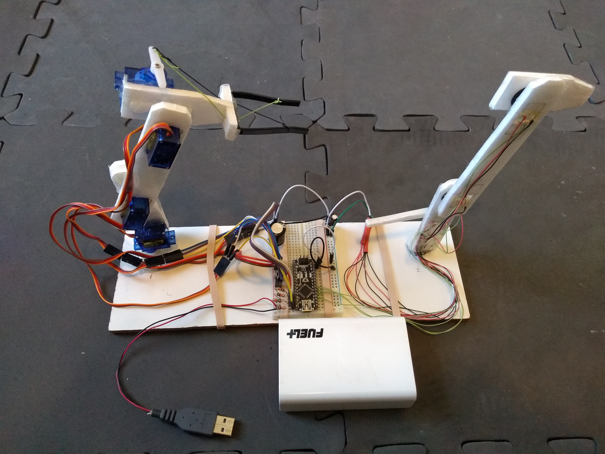
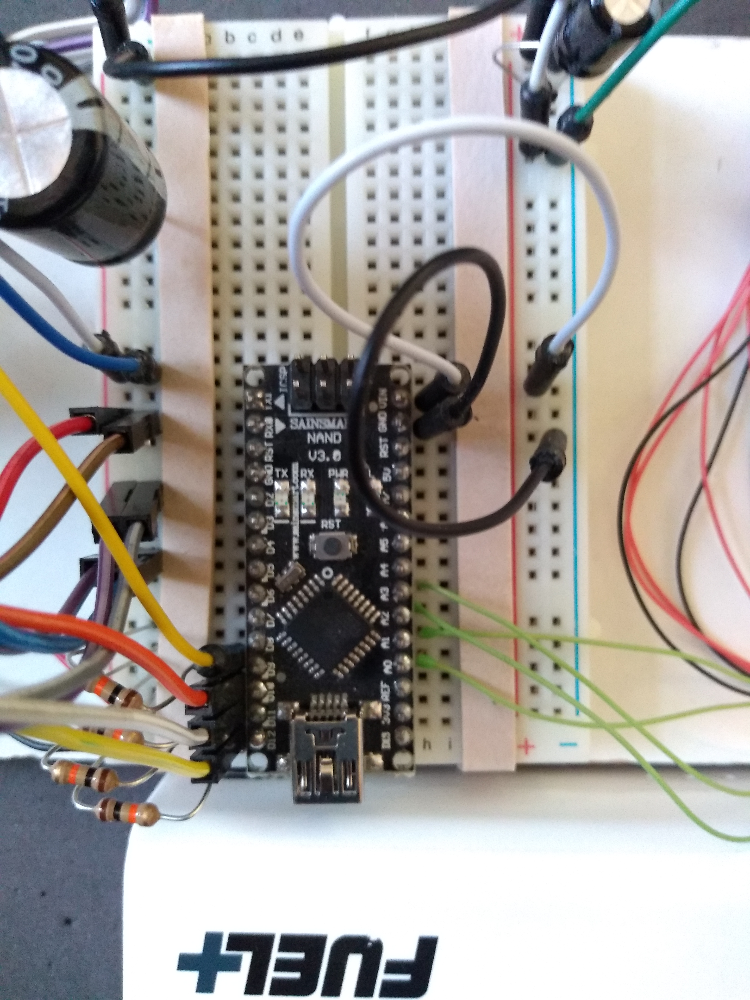
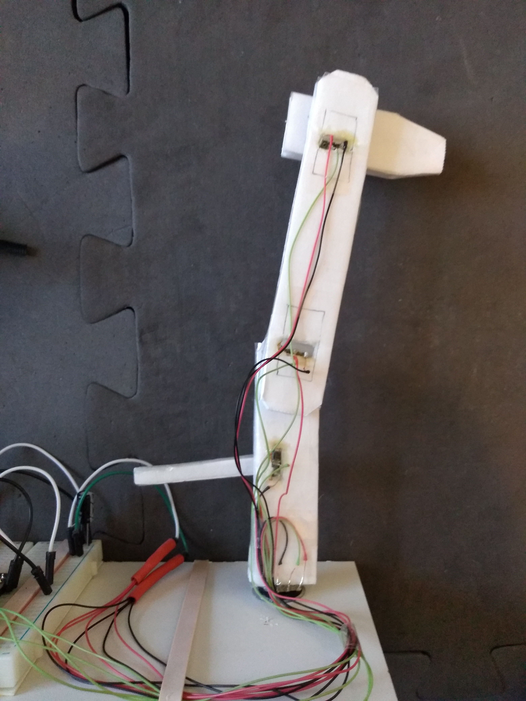
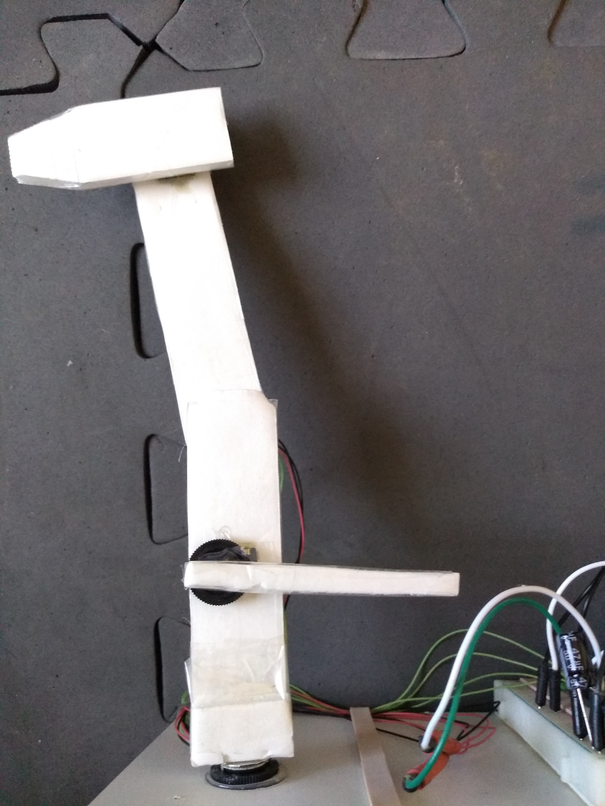
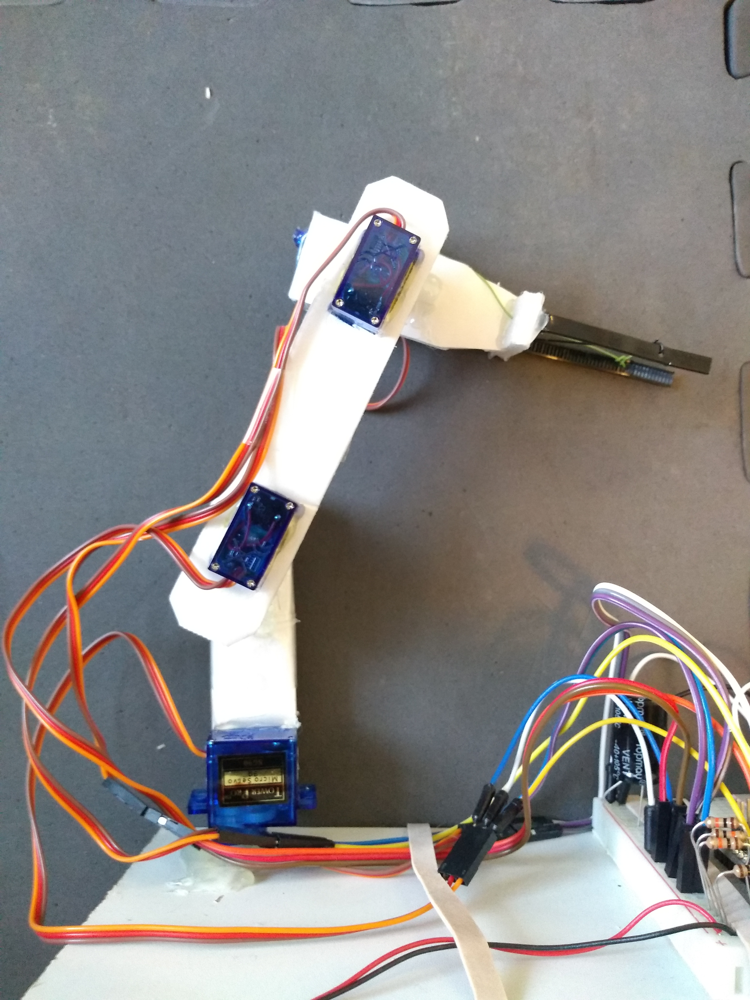
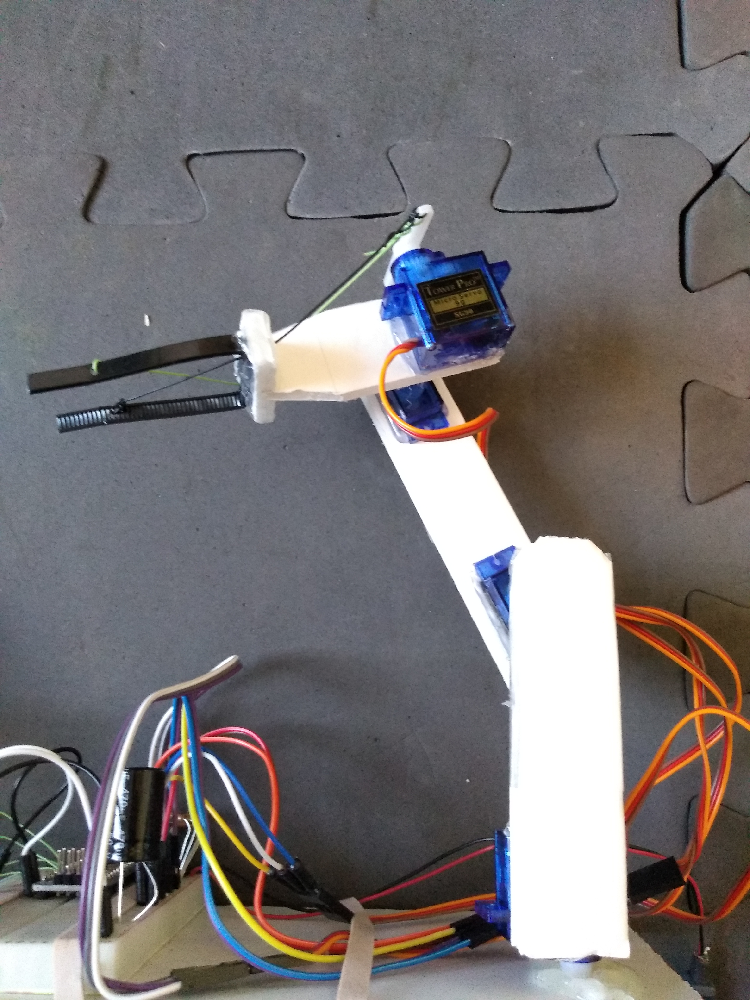

# ArduinoRobotArm
I did this project just for fun inbetween college semesters. It is an Arduino Robot Arm made from foam board. I used the VarSpeedServo libarary so that the servo speed can be adjusted. It also detaches the servos inbetween movements to save power and reduce jitter.  
Parts List:  
Arduino Uno  
Dollar Tree foam board  
4x SG90 servos  
470uF and 47uF capacitors  
4x 10k resistors  
bread board & wires  
2.5 Amp USB phone charger battery  
Video:  
<iframe width="560" height="315" src="https://www.youtube.com/embed/T1y2Pp_oBX0" frameborder="0" allow="accelerometer; autoplay; encrypted-media; gyroscope; picture-in-picture" allowfullscreen></iframe>  
Pics:  

